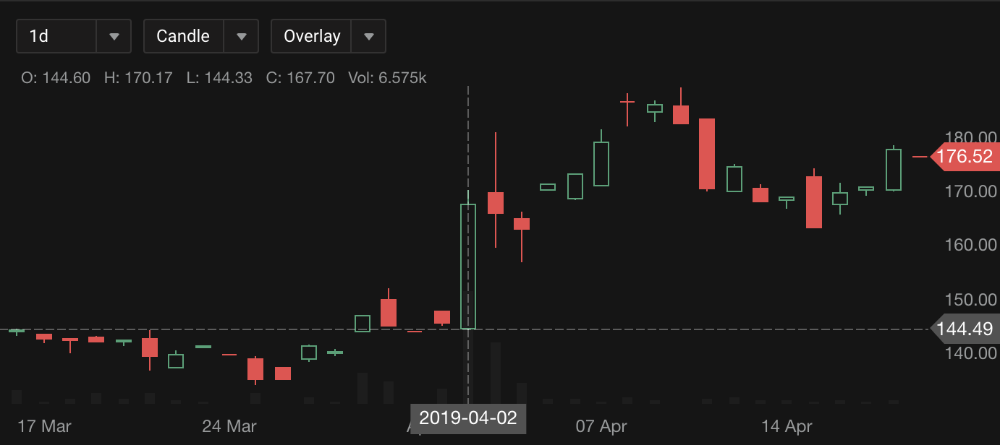
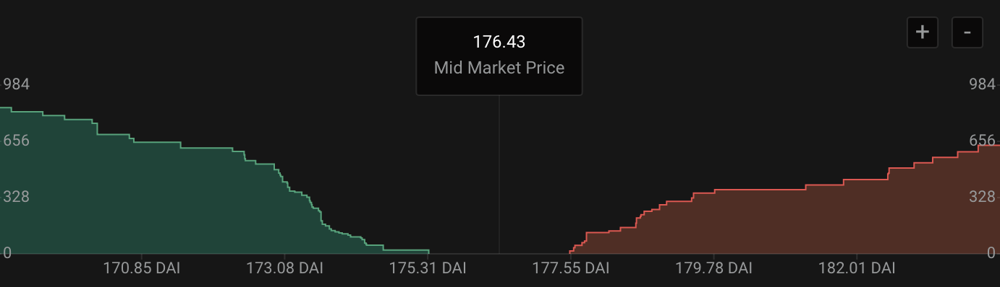

# hydro-sdk-charts

**WIP:** this project is under very active development, and it is not ready for production usage. This warnning will be removed when it is reliable.

The hydro-sdk-charts including trade chart and deep chart.

## Installation

The package can be installed via NPM:

```
npm install react-calendar-card --save
```

## Usage

### TradeChart Example



Data format example [TradeChart test data](https://github.com/HydroProtocol/hydro-sdk-charts/blob/master/assets/js/TradeChartTestData.js)

```
<TradeChart
  theme="dark" // or light
  data={testData}
  styles={{ upColor: 'blue' }}
  clickCallback={result => {
    console.log('result: ', result);
  }}
  clickGranularity={result => {
    console.log('result: ', result);
  }}
/>
```

TradeChart Props

```
interface Styles {
  background?: string;
  upColor?: string;
  downColor?: string;
  axisColor?: string;
  barColor?: string;
}

interface Props {
  data: any;
  width: any;
  ratio: any;
  height: any;
  currentMarket: any;
  clickCallback?: any;
  theme?: any;
  handleLoadMore?: any;
  clickGranularity?: any;
  styles?: Styles;
}
```

### DeepChart Example



Data format example [TradeChart test data](https://github.com/HydroProtocol/hydro-sdk-charts/blob/master/assets/js/DeepChartTestData.js)

```
<DeepChart
  theme="dark" // or light
  asks={bids}
  bids={asks}
  baseToken="HOT"
  quoteToken="DAI"
  clickCallback={result => {
    console.log('result: ', result);
  }}
/>
```

DeepChart Props:

```
interface Styles {
  titleColor?: string;
  axisLabelColor?: string;
  axisColor?: string;
  rowBackgroundColor?: string;
  containerBackgroundColor?: string;
  askColor?: string;
  askColorArea?: string;
  bidColor?: string;
  bidColorArea?: string;
}

interface Props {
  bids: any;
  asks: any;
  theme?: any;
  priceDecimals?: any;
  amountDecimals?: any;
  baseToken: any;
  quoteToken: any;
  clickCallback?: any;
  styles?: Styles;
}
```
